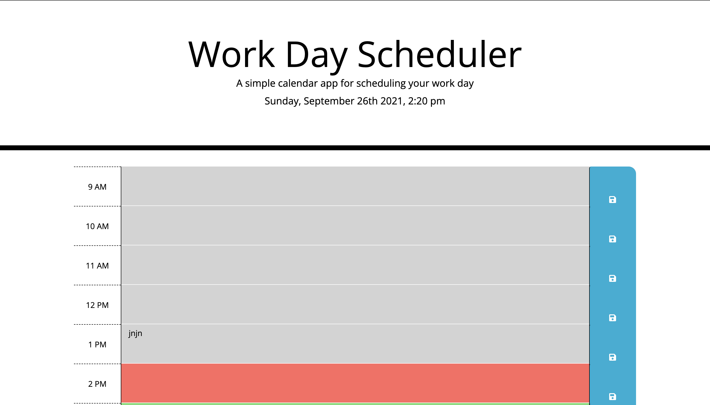

A simple calendar application that allows a user to save events for each hour of the day. This app runs in the browser and features dynamically updated HTML and CSS powered by jQuery.

Click to try:
https://jvazquez90.github.io/Work-Day-Calender/

